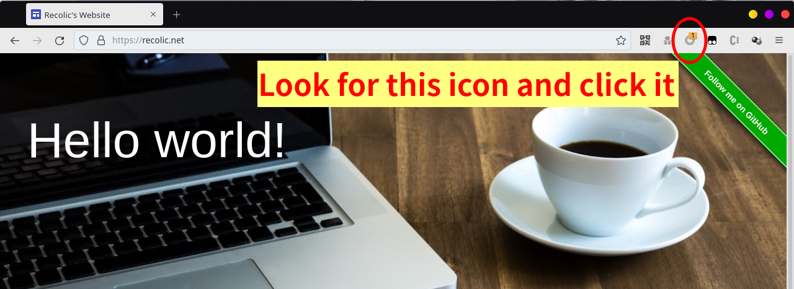
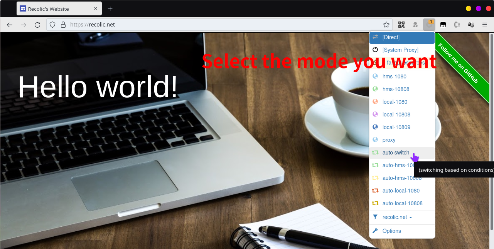

# How to change the mode of SwitchyOmega

SwitchyOmega is installed to your FireFox or Chrome browser. Take the following steps: 

## If you can not find the icon of SwitchyOmega

1. Close your browser and restart it. 
2. If it still not exists, click [this icon](./switchyomega3.png) and then click `Proxy SwitchyOmega`. 
3. If it still not exists, call Recolic to re-deploy this browser. 

